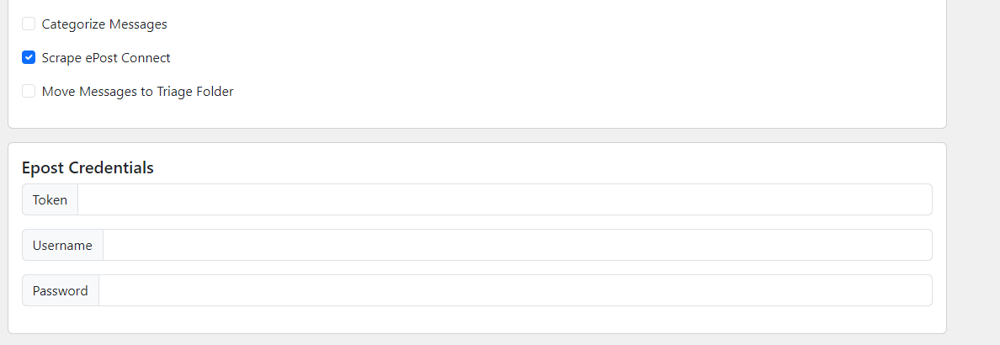

# ePost Downloader

## Overview

ePost Downloader is a Python application using the Eel library to create a desktop application with a Bootstrap-based frontend.
This app utilizes the Canada Post ePost API to download messages from applicants with various options for filtering and categorization.

## Features

- **Download Messages:** Download messages from ePost Connect using the API.
- **Date Range Filtering:** Specify start and end dates to filter messages.
- **Message Selection:** Choose to download all messages or only the new ones.
- **Categorization:** Optionally categorize messages.
- **Metadata Scraping:** Scrape metadata from the ePost Connect website.
- **Automatic Triage:** Move downloaded messages to the triage folder automatically.

## Prerequisites

- **Python 3.11.6:** Ensure you have Python 3.11.6 installed.
- **Canada Post Token:** Obtain a token from Canada Post to access the ePost API. 
- **ePost Connect Credentials:** If scraping metadata, you will need the username and password for your ePost Connect account.
- **Chromedriver:** Required for scraping ePost Connect using Selenium.
    - Download the chromedriver from the official site. Make sure to choose the version that matches your Chrome browser.
    - Place the chromedriver in the root directory of the project.

## Installation

1. **Clone the Repository:** https://github.com/robert1021/epost-downloader.git

2. **Install Dependencies:** Create a virtual environment and install the required packages (pip install -r requirements.txt)

## Usage

1. **Run the Application:** python main.py

2. **Using the interface:**
    
    - Open the application and enter the start and end dates for the messages you want to download.
    - Choose whether to download all messages or only new ones.
    - Optionally, select if you want to categorize messages.
    - If scraping metadata, ensure the ePost Connect credentials are provided.
    - Optionally, select if you want to move the messages to the triage folder.
    - Click "Start" to begin the download process.
    - Wait for the messages to finish downloading.

3. **After Downloading:**
    - Once the download process is complete, there should be a "downloads" folder that gets created in the root directory of the project.
      This folder will contain all the messages that were downloaded.

## Packaging the Application

To package the application into an executable file for distribution:

1. **Run the Packaging Script**
   - python package_app.py
   - This script will use Pyinstaller to create a standalone .exe file.

2. **Locate the Executable:**
   - After running the script, the executable file will be located in the dist directory within your project.
     The file will be named ePost_Downloader.exe or similar, depending on how the packaging script is configured.
   
3. **Distribute the Executable:**
   - You can now distribute the executable file to users who do not have Python installed. They can run the .exe file directly on Windows systems.

## Screenshots

*App*

*Enter Start Date*

*Enter End Date*

*Run With Categorize Messages*

*Scrape ePost Connect*
